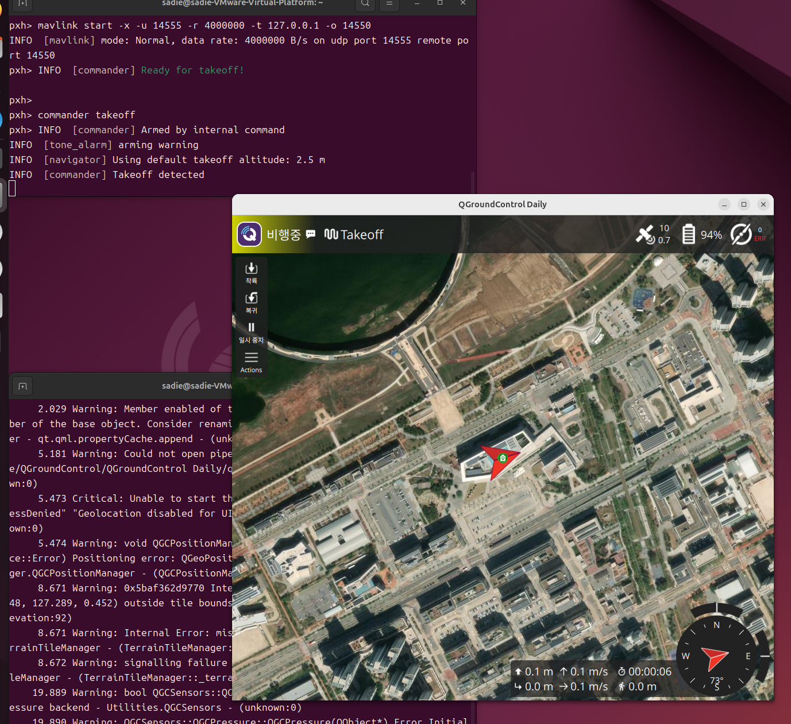

# PX4 SITL + QGroundControl 실증 환경 구축 (VMware Ubuntu)

## 목차

- [환경](#환경)
- [사전 설치](#사전-설치)
- [실행 절차](#실행-절차)
- [문제 원인과 해결](#문제-원인과-해결)
- [참고: 트러블슈팅](#참고-트러블슈팅)

---

## 환경

| 항목 | 값 |
| --- | --- |
| Host OS | Windows (VMware Workstation) |
| Guest OS | Ubuntu 24.04.4 LTS |
| VM 리소스 | Memory 8GB, Processors 4 이상 권장 |
| Docker | 29.1.3 |
| PX4 이미지 | `jonasvautherin/px4-gazebo-headless` |
| QGroundControl | Daily build (AppImage, x86_64) |

처음엔 VM을 2코어/4GB로 시작했는데, PX4랑 QGC를 같이 켜니까 CPU가 못 버텨서 `Accel #0 fail: TIMEOUT` 에러가 계속 났다. 4코어/8GB로 늘리고 나서야 안정적으로 돌아갔음!

---

## 사전 설치

### Docker

```bash
sudo apt update
sudo apt install -y ca-certificates curl gnupg
sudo install -m 0755 -d /etc/apt/keyrings
curl -fsSL https://download.docker.com/linux/ubuntu/gpg | sudo gpg --dearmor -o /etc/apt/keyrings/docker.gpg
echo "deb [arch=$(dpkg --print-architecture) signed-by=/etc/apt/keyrings/docker.gpg] https://download.docker.com/linux/ubuntu $(. /etc/os-release && echo "$VERSION_CODENAME") stable" | sudo tee /etc/apt/sources.list.d/docker.list > /dev/null
sudo apt update
sudo apt install -y docker-ce docker-ce-cli containerd.io docker-buildx-plugin docker-compose-plugin
sudo usermod -aG docker $USER && newgrp docker
```

### QGroundControl

```bash
sudo usermod -aG dialout "$(id -un)"
sudo apt install -y libfuse2 libxcb-xinerama0 libxkbcommon-x11-0 libxcb-cursor-dev \
  gstreamer1.0-plugins-bad gstreamer1.0-libav gstreamer1.0-gl python3-gi python3-gst-1.0

wget https://d176tv9ibo4jno.cloudfront.net/builds/master/QGroundControl-x86_64.AppImage
chmod +x QGroundControl-x86_64.AppImage
```

예전에 많이 쓰던 `latest/QGroundControl.AppImage` 링크는 지금 403 Forbidden으로 막혀 있다. 위의 `builds/master/` 경로로 받아야 한다.

---

## 실행 절차

**1. PX4 SITL 실행** (터미널 1)

```bash
docker run --rm -it --network host \
  -e PX4_HOME_LAT=36.4800 -e PX4_HOME_LON=127.2890 -e PX4_HOME_ALT=0.0 \
  jonasvautherin/px4-gazebo-headless
```

- `--rm` : 컨테이너 종료 시 자동 삭제 (테스트용이라 여러 번 켰다 껐다 하니까 안 지우면 계속 쌓임)
- `--network host` : 컨테이너가 VM의 네트워크를 그대로 공유하게 함. 원래는 `-p 14550:14550/udp`처럼 포트만 매핑하는 방식으로 했는데, 그러면 Docker의 포트 포워딩 프로세스가 포트를 독점해버려서 QGC가 못 들어옴. 이 옵션으로 그 문제를 우회함
- `-e PX4_HOME_LAT/LON/ALT` : 드론이 출발할 위치(위도/경도/고도). 충청권 좌표로 설정
- `jonasvautherin/px4-gazebo-headless` : PX4 + Gazebo가 미리 세팅된 Docker 이미지 이름

`pxh>` 프롬프트가 뜰 때까지 기다린다.

**2. PX4 콘솔에서 통신 설정** (`pxh>`에 순서대로 입력)

```
param set MAV_0_BROADCAST 1
mavlink stop-all
mavlink start -x -u 14555 -r 4000000 -t 127.0.0.1 -o 14550
```

- `param set MAV_0_BROADCAST 1` : PX4는 기본적으로 MAVLink 신호를 컨테이너 안(localhost)에서만 유지하도록 되어 있다. 이 값을 1로 켜야 밖으로도 신호가 나간다.
- `mavlink stop-all` : 기존에 돌던 MAVLink 채널을 전부 종료. 새 설정을 적용하려면 한 번 꺼야 한다.
- `mavlink start -x -u 14555 -r 4000000 -t 127.0.0.1 -o 14550` : MAVLink를 새로 시작하는 명령.
  - `-u 14555` : PX4가 자기 쪽에서 쓰는 로컬 포트
  - `-r 4000000` : 데이터 전송 속도(byte/s)
  - `-t 127.0.0.1` : 신호를 보낼 대상 IP (여기선 같은 VM 안이니 자기 자신)
  - `-o 14550` : 목적지 포트. QGC가 리스닝할 포트를 여기로 지정

  PX4와 QGC가 같은 14550 포트를 동시에 열려고(bind) 하면 충돌이 나서, PX4는 14555에서 보내고 QGC는 14550에서 받도록 포트를 나눈 것이 핵심이다.

**3. QGroundControl 실행** (터미널 2, 새 창)

```bash
./QGroundControl-x86_64.AppImage
```

**4. 연결 확인**

자동으로 연결되면 좋고, 안 되면 수동으로 링크를 만든다.
QGC 좌상단 `Disconnected` 클릭 → Comm Links → Add → Type: `UDP`, Listening Port: `14550` → Save → Connect

**5. 이륙 테스트** (`pxh>`)

```
commander takeoff
```

QGC 화면 상태가 `Ready` → `Takeoff` → `비행중`으로 바뀌고, 위성 개수·배터리·좌표가 표시되면 성공이다.


> PX4 콘솔에서 `commander takeoff` 실행 후, QGC에서 "비행중 / Takeoff" 상태로 전환되고 위성 10개, 배터리 94%, 실제 좌표(충청권)가 지도 위에 표시되는 것까지 확인한 화면.

---

## 문제 원인과 해결

처음에 `docker run -p 14550:14550/udp` 방식으로 시도했을 때는 QGC가 계속 "Disconnected" 상태였지만! 해결함

| 증상 | 원인 | 해결 |
| --- | --- | --- |
| QGC에서 `UDP Link error: Address already in use` | Docker의 포트 포워딩 프로세스(`docker-pr`)가 포트를 독점(bind)해서, QGC가 같은 포트를 열려는 시도와 충돌 | `--network host`로 컨테이너와 호스트 네트워크를 공유시켜 포트 포워딩 자체를 없앰 |
| `--network host`로 바꿔도 데이터가 안 옴 (`tcpdump`로 확인) | PX4 기본 설정상 MAVLink가 localhost 내부로만 제한됨 | `param set MAV_0_BROADCAST 1`로 외부 브로드캐스트 허용 |
| 여전히 UDP bind 충돌 반복 | PX4와 QGC가 같은 포트(14550)를 동시에 리스닝하려고 시도 (UDP는 한 프로세스만 포트를 열 수 있음) | PX4는 `14555`에서 송신, `-o 14550`으로 QGC가 리스닝하는 `14550`을 목적지로 명시해서 포트 역할을 분리 |
| `Accel #0 fail: TIMEOUT` 반복, Failsafe 발동 | VM(2코어/4GB)에서 Gazebo 물리 연산이 CPU를 못 따라감 | VM을 4코어/8GB로 증설. 완전히 없어지진 않지만 이륙 직후 몇 분 동안은 안정적으로 동작함 |

가장 도움이 됐던 진단 방법은 `sudo tcpdump -i lo -n udp port <포트번호>`로 실제 UDP 트래픽이 오가는지 직접 확인하는 것이었다. 포트가 "열려있다"는 것과 "실제로 데이터가 흐른다"는 건 다른 문제였다.

---

## 참고: 트러블슈팅

- Docker 컨테이너가 여러 개 겹쳐서 실행되어 있으면(예전 `-p` 방식 컨테이너와 `--network host` 컨테이너가 동시에 남아있는 경우 등) Gazebo 인스턴스끼리 충돌하며 TIMEOUT을 유발한다. `docker ps -a`로 항상 확인하고 `docker rm -f $(docker ps -aq)`로 정리한다.
- QGC 프로세스가 창을 닫아도 완전히 안 죽고 포트를 계속 물고 있는 경우가 있었다. `pkill -9 -f QGroundControl`로 강제 종료하면 된다.
- QGC 설정이 꼬였다 싶으면 `rm -rf ~/.config/QGroundControl.org`로 초기화하고 다시 실행한다.
- VM 하드웨어 설정(Memory/Processors)은 VM이 완전히 꺼진 상태(Powered off)에서만 바꿀 수 있다.

---

작성: 김수영 · CCSC 2026 팀 TNT
